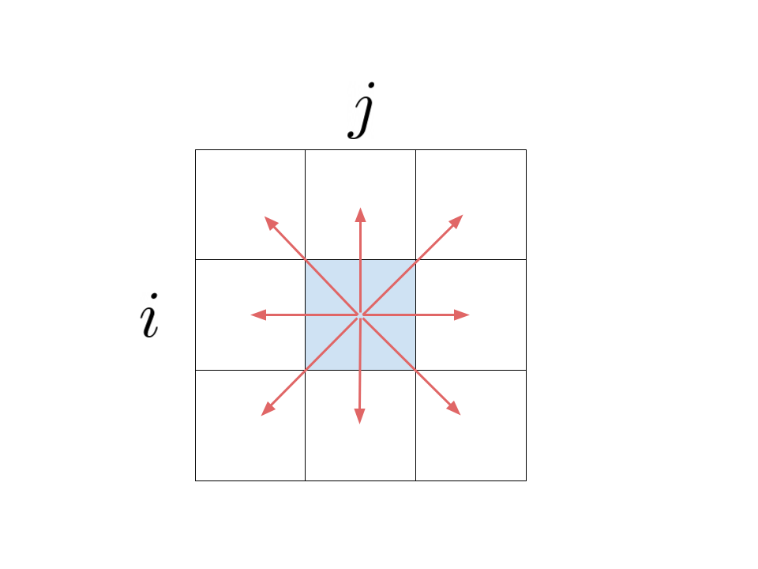
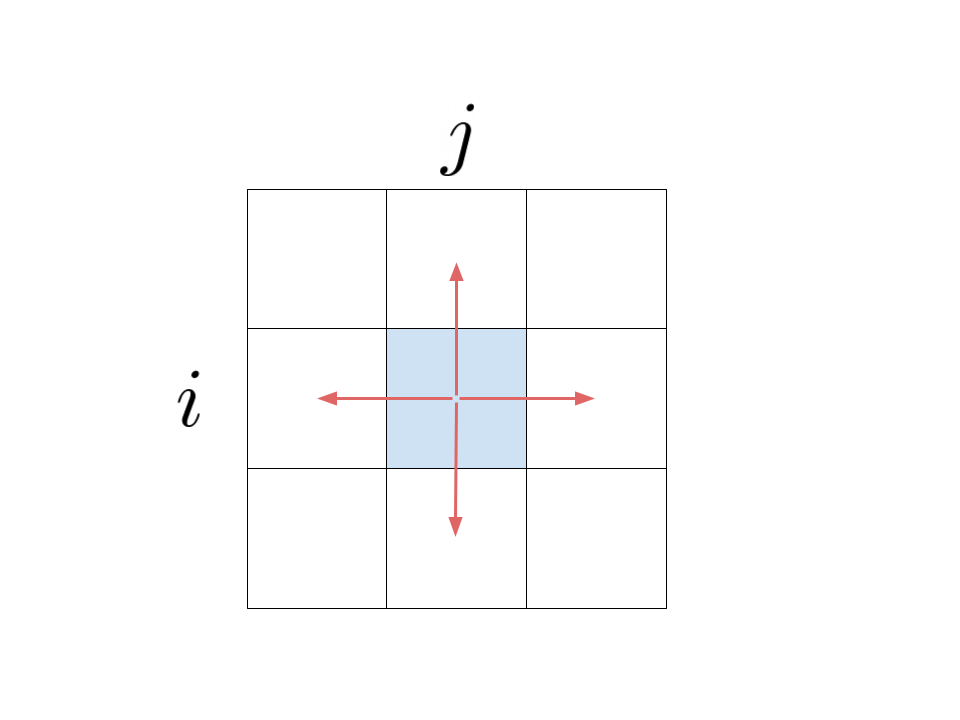
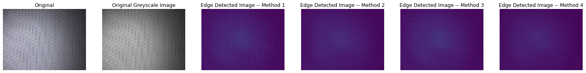
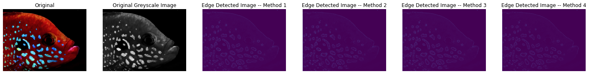

# Edge-Detection

This project is to detect edges in images. This could later be used in image sharpening. Image sharpening is when you enhance the definition of edges in an image. 

I tried four different edge detection methods. 

Method 1:
In Method 1, you subtract the smoothed image from the original image. To smooth an image, you make each pixel the average of the 8 pixels around it and itself.

The next following 3 methods are variations of calculating the slope of each pixel with respect to its surrounding 8 pixels.

Method 2:

In Method 2, we use the slope or intensity changes of the surrounding pixels to decide the new value of the pixel. Each pixel is equal to the slope of the bottom left pixel and from the top left pixel added to the slope of the top right pixel the  bottom right pixel.

pixel = im[x, y]

sum = (im[x - 1, y - 1] - im[x - 1, y + 1])

sum += (im[x + 1, y + 1] - im[x + 1, y - 1])

new_im[x, y] = np.abs(sum)

Method 3:

In Method 3, each pixel equal to the eight slopes of itself and the eight surrounding pixels.

sum = 8*(im[x, y]) - (im[x - 1, y + 1]) - (im[x - 1, y]) - (im[x - 1, y - 1]) - (im[x, y + 1]) - (im[x, y - 1]) - (im[x + 1, y + 1]) - (im[x + 1, y]) - (im[x + 1, y - 1])

new_im[x, y] = np.abs(sum)

Method 4:

In Method 4, eanch pixel is equal to the slope of itself and each of the four horizantal and vertical pixels beside it.

sum = 4 * im[x, y] - (im[x-1, y] + im[x + 1, y] + im[x, y + 1] + im[x, y - 1])

new_im[x, y] = np.abs(sum)

Which method is the best for cartesian patterns?

From this comparison, Method 1, 3, 4 are the best. Method 2 isnt too good because it only uses the diagonal pixels. 

Which method is the best for radial patterns?

From this comparison, Method 1, 2, 3 are the best. Method 4 isnt too good because it only uses the horizontal and vertical pixels. 
