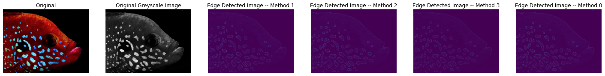
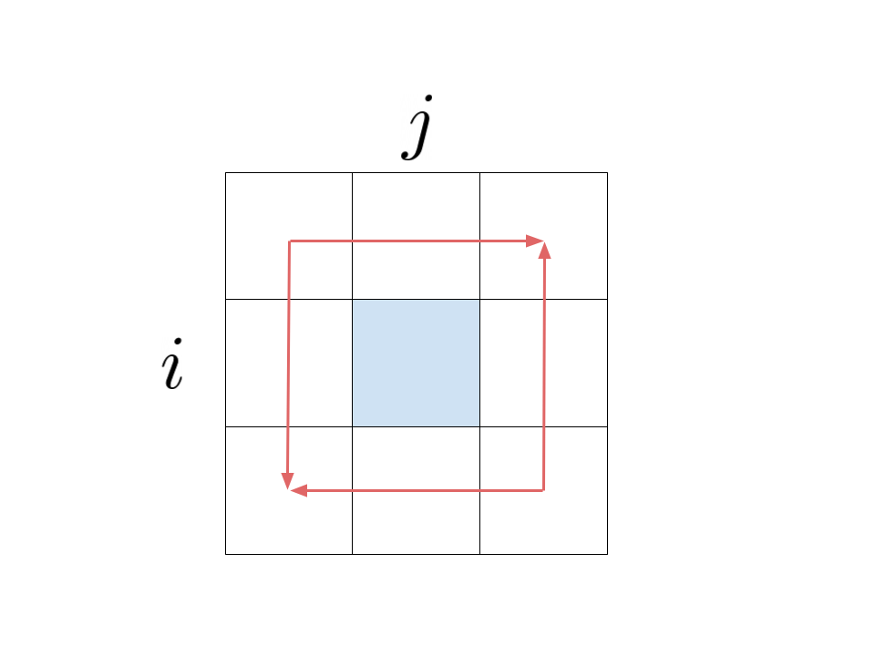

# Edge-Detection

This project is to detect edges in images. This could later be used in Image Sharpening. Image Sharpening is when you enhance the definition of edges in a images. 

Edge Detection could be done in four ways. 

Method 1:
In this method, you subtract the smoothed image from the original image. To smooth an image, you make each pixel the average of the 8 pixels around it and itself.

Method 2:

